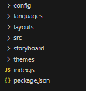
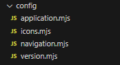
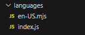

# Quasar Studio

Quasar Studio is a standard Quasar project that embeds a lot of preconfigured content to create enterprise web application.

Quasar Studio Web Application is a combination of a standard Quasar SPA application, named "client" and a npm package that includes all configuration needed, called "app"

A typical Quasar Studio Application has a root folder that contains two sub-folders, one for the client and another one for the app.

Quasar Studio comes with a handy CLI that helps developers to create content

> Note: **CLI** stands for Console Line Interface, this means an application without a proper UI, only commands using a terminal session

## Get Started

### Prerequisites

1. Install [NPM][1] (open a new terminal session and check with `npm -v` if it is available on your machine)
1. Install [GIT][2] (same as avove, check with `git --version`)
1. Install [Quasar CLI][3] (check with `quasar --version`)
1. Install [Quasar Studio CLI][4] (check with `qstudio --version`)

To see all Quasar Studio CLI commands, just type `qstudio -h`

> Commands in Quasar Studio CLI can have three scopes:
>
> - _general_, these can be run in every folder (i.e.: init, help. etc)
> - _project_, these commands are prefixed with _qs:_ and can be run only into a Quasar Studio Project folder (i.e.: qs:test)
> - _app_, these commanda are prefixed with _app:_ and can be run only into a Quasar Studio App folder

### Create a new Quasar Studio Project

Let's assume we want to create a chat web application, named MyChat.

1. Open a new terminal session into a folder where you want to create the project and type `qstudio init`

This _init_ command allow you to create a Quasar Studio Project that contains at least two folders, one is the client (a Quasar SPA web application) and the other is teh actual application configuration.
This command wil propmpt you 4 questions:

- Quasar Studio Project folder name: Keep the default one (QSProject) or choose another one
- Application name: this is your application name, i.e.: MyChat
- Select one application template: A list of application templates already configured, choose the one you prefer or keep it the defualt one ('empty' is, as name suggests, an empty application)
- Author: your name (you can keep it empty)

Once provided these answers, a new folder is created and if you change your current directory to the one just created (in this example QSProject) you will find two subfolders, named 'client' and 'app-mychat'

> NEVER open or change content in the client folder, just use app-mychat

Your application, even if completely empty, can be tested by typing `qstudio qs:test`

> Terminal is now blocked for serving your web application. Press CTLR-C to stop it or open a new terminal session

#### Quasar Studio Repository

When you want to create a new web application, you can follow two approaches:

1. Repeat the process described above in another directory. This will create the same structure just mentioned
1. Stay on the existing Quasar Project folder (in our example QSProject) and type `qstudio qs:new`

This command will create a new app folder at the same level of the existing one(s). With this approach you will have one _client_ folder and many _app-_ folders, one for each application. To choose which one you want to test, use the command `qstudio qs:use`

> If your web application is running, using the qs:use command will automatically switch the browser to the right application

## Application structure

Within a Quasar Studio Project folder there are at least two folders, your application is configured into the _app-_ folder.

> If you use the repository approach described above, you can have multiple _app-_ folders

Open a new Visual Studio Code window and select your _app-_ folder. Let's review the structure of your application:



- **config** is where the majority of your app configuration is done
- **languages** is where your app language scripts are defined
- **layouts** is where your multiple layout (even based on device capabilities) are defined
- **src** is where it is possible to create custom content using Quasar and VueJS capabilities
- **storyboard** is where all pages are defined
- **themes** is where your theme (colors) are defined

### Config folder



- [**application.mjs**](#application) is where you describe your own application
- [**icons.mjs**](#icon-library) is where all icons are mapped
- [**navigation.mjs**](#navigation) is where all main menus are defined
- **version.mjs** is where your current version is stored

#### Application

This file (_application.mjs_) exports a standard JS Object with all global definitions of the Web Application

An example of this file is the following:

```js
export const application = {
  // Manifest version of this framework
  manifestVersion: "0.1.1",

  // Name of the application
  name: "<name>",

  // Title (Public name) of the application
  title: "<title>",

  // Credits
  credits: {
    author: "",
    copyright: "MIT",
  },

  // Versioning mode
  versioning: "manual",
};
```

These are the property of this file:

- **manifestVersion**, this reports the version of the Quasar Studio Application Framework in use, **DO NOT CHANGE IT MANUALLY**

  > Quasar Studio CLI has a _qs:update_ command to update the framework configuration to the latest one

- **name**, this is the name of the application
- **title**, this is the official title of the application (if missing _name_ will be used)
- **credits**, this is a standard object shown by the credit popup screen. A credit popup screen is shown if the user clicks on the version element (see later)
- **versioning**, this is how versioning will be handled in your application:

  - _manual_, this means you have to take care of it by changing manually the version (_version.mjs_ file)

  > Quasar Studio CLI has a _app:version_ command to update the version

  - _auto_, this means Quasar Studio CLI update the version anytime a new build is created, using the MAJOR.MINOR.PATCH progression (i.e.: 1.4.2)
  - _date_, this means Quasar Studio CLI update the version anytime a new buils is created, using the YEAR/MONTH progression (i.e: 2408 equals to Aug 2024)

---

#### Icon Library

This file (_icons.mjs_) exports an iconLibrary JS Object where all icons used by the application are listed.

> Some of them (prefixed with _qs-_) might be used by preconfigured content, if removed a default icon will be shown instead.

An example of this file is the following:

```js
export const iconLibrary = {
  "qs-bars": "fa-solid fa-bars",
  "qs-home": "fa-solid fa-house",
  "qs-back": "fa-solid fa-circle-left",
};
```

Each key-value pairs describes the name used into the application (i.e. qs-bars) and the value into the icon library (i.e. "fa-solid fa-bars" in FontAwesome)

By default either _FontAwesome v6_ and _Google Material_ icons library are enabled. To activate additional icon libraries please refer to this document: [How to extend icon libraries](https://quasar.dev/options/installing-icon-libraries#introduction)

---

#### Navigation

This file (_navigation.mjs_) exports a standard JS Object where it is described navigation menus items.

An example of this file is the following:

```js
export const navigation = {
  position: "panel",

  items: [
    {
      name: "home",
      title: "Home",
      icon: "qs-home",
      to: "home-page",
    },
    {
      ...
    },
  ],
};
```

These are the property of this file:

1. **position**, this is where the navigation menu is shown.

- _none_, this means the navigation menu is not automatically shown and must be included, manually, in any part of the layout/page (see _public components_)
- _header_, this means the navigation menu will be placed within the header section of the layout (horizontal menu)
- _footer_, this means the navigation menu will be placed within the footer section of the layout (horizontal menu)
- _left_, this means the navigation menu will be placed within the left panel section (middle slot) of the layout (vertical menu)
- _right_, this means the navigation menu will be placed within the right panel section (middle slot) of the layout (vertical menu)

> Vertical menu can contains unlimited number of nested submenus (see later), but practically the available space suggests to keep these levels above 3

> Horizontal menu shows only top level menu items, submenus are simply ignored

2. **items**, this is an array of menu items. Let's see how to define a menu item

##### Menu Item

A menu item is a standard JS object that describes how the menu item is shown and interact with the user.
These are the property of a menu item:

- **name**, a unique name of the menu item. This will be used to define what actions should be executed when the user clicks on it
- **title**, this is the title of the menu item (in case of multi-lingual, this should be a key of language files)
- **caption**, this is the subtitle (optional) (see above for multi-lingual)
- **icon**, icon to be shown (optional), referring to an icon in the icon library
- **to**, name of the page where redirecting (optional)
- **style**, this is a standard JS object that defines a specific style for the menu item:
  - _backcolor_, color of the background
  - _textcolor_, color of the foreground
  - _iconcolor_, color of the icon

> Style defined at this level overrides any style defined at the theme level

- **items**, this is an array of sub menu-items (optional)

---

#### Version

This file (_version.mjs_) exports a standard JS Object where it is defined the current application version.

An example of this file is the following:

```js
export const version = {
  number: "1.1.0",
  build: "454587",
};
```

These are the property of this file:

1. **number**, this is the current version. Can be expressed in several shapes, depending of the versioning type choosen in the _application.mjs_ file:

- _manual_, any string is correct. This must be manually changed.
- _auto_, version is updated automatically anytime a new build is created. The form is Major.Minor.Patch

  > Major number should be increased when a an substantially new version is released
  > Minor number should be increased when some changes occurred
  > Patch number should be increased when bugs are fixed or very minor changed occurred

- _date_, version is updated automatically anytime a new build is created. The form is YearMonth
  > This type of versioning helps to understand the timeline of the product. In fact, releasing a new version in Mar 2025 will have a new version 2503

1. **build**, this is an incremental build number (automatically generated unless the versioning type _manual_ is selected)
   > A build number helps developers to understand the exact build version

If versioning type is _manual_, it is possible to use the Quasar Studio CLI to update the version, using the following command: `qstudio app:version [options]` (see the command help to understand how to change the version)

If versioning type is _auto_ or _date_ version will be updated once created a new release with the build command: `qstudio qs:build [options]` (see the command help to understand how to change the version)

---

### Language folder



This folder contains an _index.js_ file and optionally some language files, with their isocode name

> Isocode can be in the following form:
> [Language] for example en, fr, it
> [Language]-[Country] for example en-us, fr-ca, it-IT

The index file contains settings to activate or not the multi-lingual capabilities

An example of this file is the following:

```js
export const languages = {
  multiLanguage: false,
};
```

> By default multilingual support is turned off.

By setting the property multiLanguage to _true_ this enables support for multiple languages. In that case an additional property must be added to define the default language

```js
export const languages = {
  multiLanguage: true,
  default: "en-us",
};
```

Within this folder all language file are structured in the following format:

```js
export const language = {
  "qs-version": "Version",
};
```

> keys prefixed with _qs-_ are used by preconfigured, DO NOT REMOVE IT

##### How to use it

In order to use this translations in your custom Vue components, please use `$t(<your-key>)`

##### How to create a new language

In case you want to support another language, use the command `qstudio app:language -a <isocode>`
For example to add support for canadian french, type `app:language -a fr-ca`
This creates a new file (_fr_ca.mjs_)in this folder with all keys available from the default language file.

> Values must be translated

##### How to remove support for a language

Type the following command `qstudio app:language -r <isocode>`

##### How to add a new key

Adding a key to all language files could be annoying, just type the following command `qstudio app:language -ak <key` to add the same key to all available language files

##### How to remove a key

Type the following command `qstudio app:language -rk <key` to remove the key from all available language files

---

#### Storyboard.js

This file exports a storyboard JS Object where it is described pages in the application. Actually in this file is only listed all available pages, whereas the actual definition of those pages is into a js fil in the storyboard folder

An example of this file is the following:

```js
export const storyboard = {
  pages: [
    {
      name: "home-page",
      path: "common",
      url: "/",
    },
  ],
```

These are the property of this file:

- **pages**, this is an array of all pages

**Page**
A page is a standard JS object that describes how and when render a single page of the application.
These are the property of a menu item:

- **name**, name of the page (must be a valid js identifier)

  > An existing js file with the exact same name reported here needs to be defined in the storyboard folder.

- **path**, folder path (within the storyboard folder) where the page definition is
  > In this example a js file must be defined with a full path at: /storyboard/common/home-page.js
- **url**, navigation url where this page is responding to

---

#### Themes.js

This file exports a themes JS Object where it is described available themes for the application.

An example of this file is the following:

```js
export const themes = {
  default: "default",

  templates: {
    default: {
      dark: false,
      header: {
        backcolor: "green",
        textcolor: "red",
      },
      footer: {
        backcolor: "green",
        textcolor: "red",
      },
      leftPanel: {
        backcolor: "green",
        textcolor: "red",
      },
      rightPanel: {
        backcolor: "green",
        textcolor: "red",
      },
      navigation: {
        backcolor: "green",
        textcolor: "red",
        iconcolor: "red",
      },
  },
};
```

These are the property of this file:

- **default**, default theme to be applied if the user does not select a different one
- **templates**, this is an array of available themes

// DA MODIFICARE SPOSTANDO I TEMI DENTRO UNA CARTELLA /themes A LIVELLO ROOT, STESSA TECNICA DEI LAYOUTS

## Languages

This folder contains a file for each supported language.

> Use Quasar Studio CLI to create a brand new file and add the isocode into the supported property in the language section in application.js
>
> A clone of the default language file is created, in this way all keys are already available (value must be translated though)

Each file contains a standard JS object where each key has a corresponding translation for that language, like in the example below

```js
export const language = {
  version: "Version",
  customers: "Customers",
  suppliers: "Suppliers",
};
```

If a key is missing the fallback language file is the one considered the default language, if even in there is missing the key, the key itself is shown (a warning value is also reported in the browser console).

> Use the Quasar Studio CLI to create a new key, in this way a new key is created in all available files (values must be changed though).

TO DO If auto-translate is activated, a first draft translation is provided.

---

[1]: https://npmjs.org
[2]: https://git-scm.com
[3]: https://quasar.dev/start/quasar-cli
[4]: https://www.npmjs.com/package/qstudio-cli
